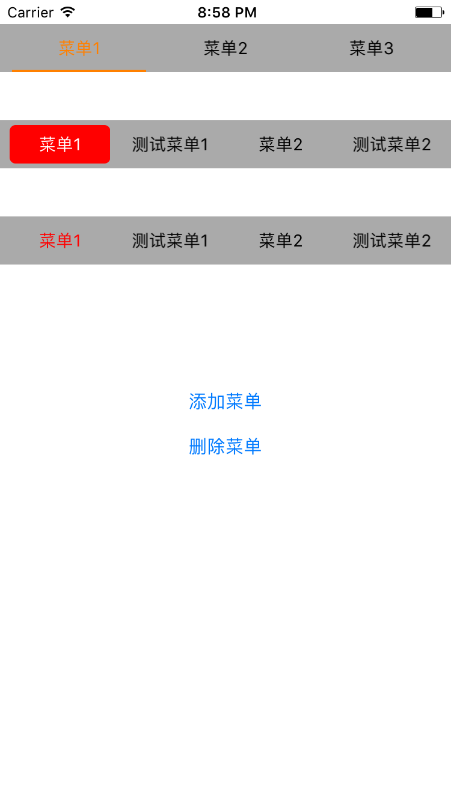

# ZJPSlideSegment

ZJPSlideSegment 是一款可以根据大部分需求自定义的分段选择器空间，现支持的样式如下：

 

### 安装

#### 手动安装

使用方法，手动下载`ZJPSlideSegment.h` 和 `ZJPSlideSegment.m`文件添加到项目中即可。

#### CocoaPod安装

`pod ZJPSlideSegmen`

### 使用方法

#### Objective-C:

`#import "ZJPSlideSegmen.h"`

```objective-c
self.segmentBackColor = [[ZJPSlideSegment alloc]initWithFrame:CGRectMake(0, 100, SCREEN_WIDTH, 40) Style:ZJPSegmentBackColorStyle];
self.segmentBackColor.backgroundColor = [UIColor lightGrayColor];
[self.segmentBackColor setItems:@[@"菜单1",@"测试菜单1",@"菜单2",@"测试菜单2"]];
[self.view addSubview:self.segmentBackColor];

[self.segmentBackColor itemClicked:^(NSString *itemTitle, NSInteger index) {
        NSLog(@"%@被选中，下标为%ld",itemTitle,(long)index);
    }];
```

#### 其他属性：

```objective-c
//选中颜色，默认为红色
@property (nonatomic,strong) UIColor *selectedItemColor;
//item未选中颜色,默认为黑色
@property (nonatomic,strong) UIColor *itemsDefualtColor;
//item字体大小，默认为14
@property (nonatomic,assign) CGFloat itemsFontSize;
//item之间的距离，默认为8
@property (nonatomic,assign) CGFloat itemesOfMargin;
//初始选中项，默认从第一个开始（下标为0）
@property (nonatomic,assign) NSInteger defualtSelectedIndexOfItem;

```

#### 运行环境

- iOS8 + 
